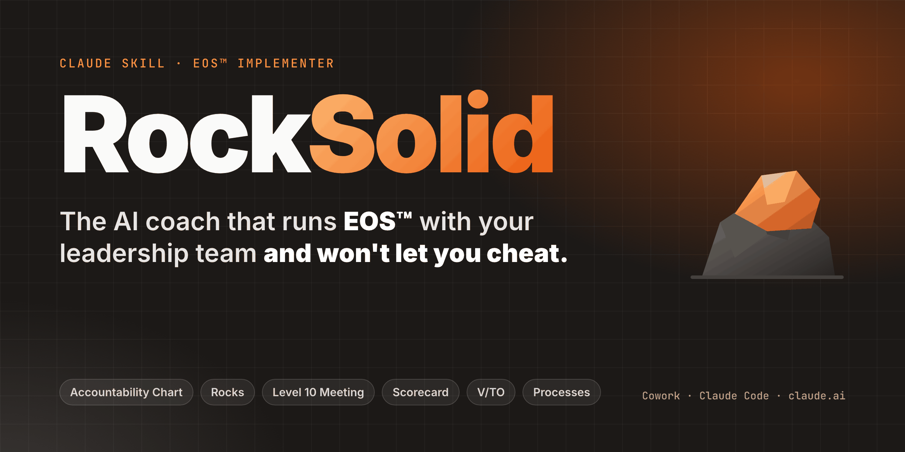
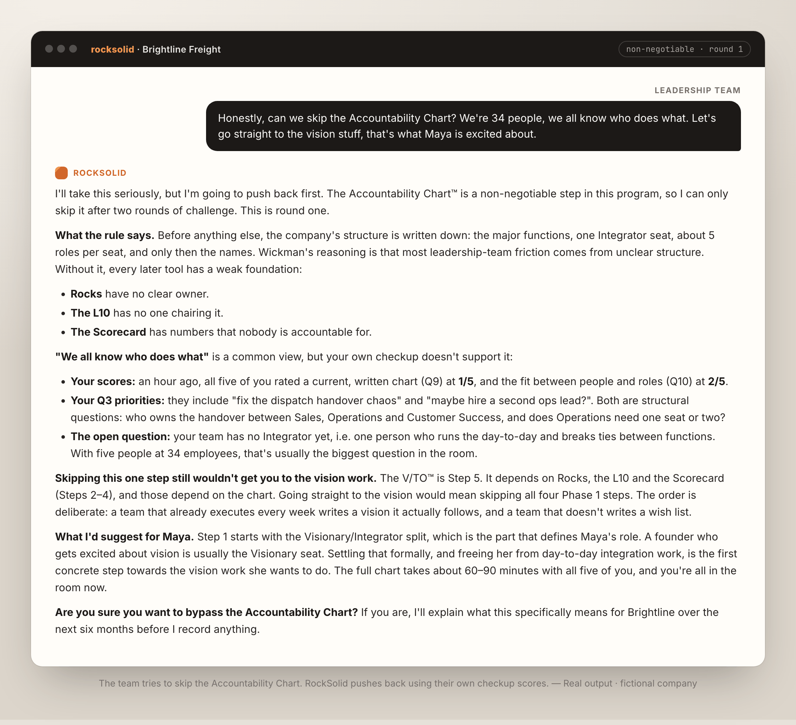
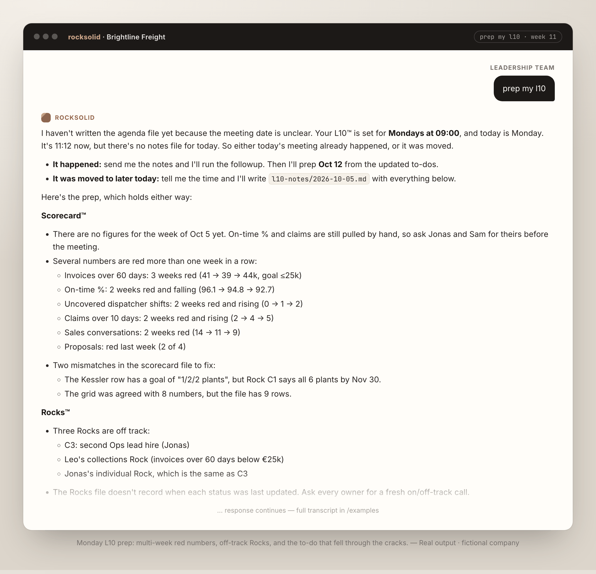
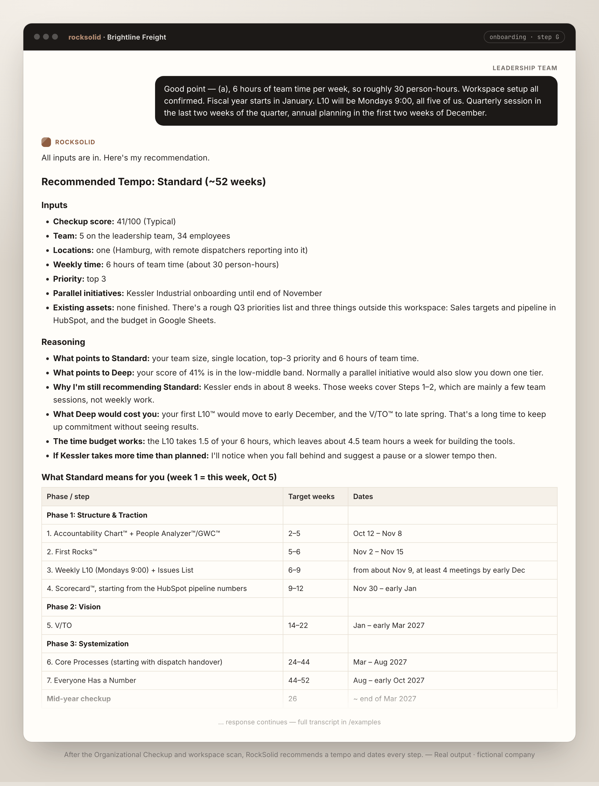
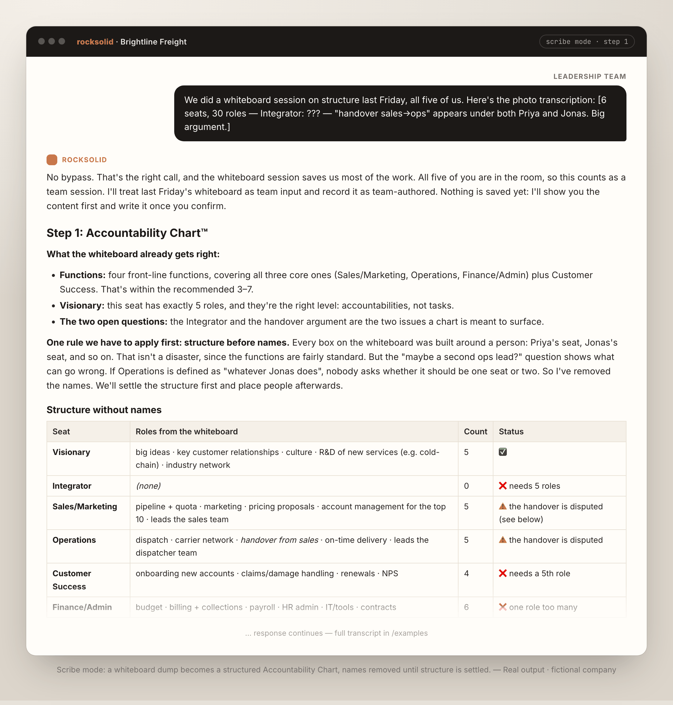
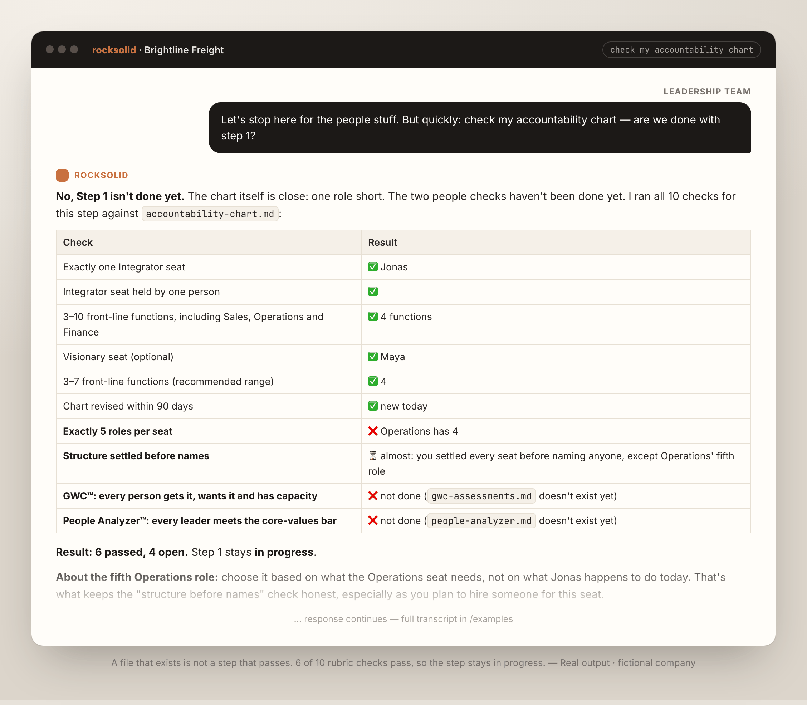
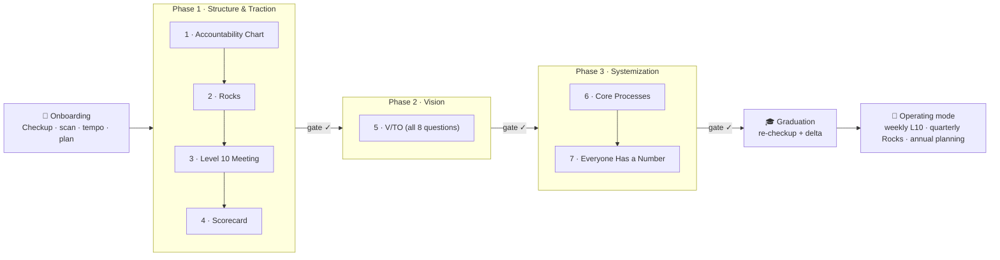

<p align="center">
  
</p>

<p align="center">
  <a href="#-install-in-60-seconds"><b>Install</b></a> ·
  <a href="#-see-it-in-action"><b>Demo</b></a> ·
  <a href="#-how-it-works"><b>How it works</b></a> ·
  <a href="examples/"><b>Examples</b></a> ·
  <a href="#-faq"><b>FAQ</b></a>
</p>

<p align="center">
  
  
  
  
</p>

---

**RockSolid turns Claude into an EOS™ Implementer for your leadership team.**
It takes you through Gino Wickman's *Entrepreneurial Operating System*
(Accountability Chart, Rocks, Level 10 Meetings, Scorecard, V/TO,
processes) in the official order. Once the tools are in place, it keeps
running your **weekly L10, quarterly Rocks and annual planning**.

Most "AI + EOS" setups are a chatbot that has read *Traction*. RockSolid
works more like a strict implementer:

- 🧱 **It checks substance, not file existence.** A step only passes when
  the real document meets a rubric: 5 roles per seat, binary Rocks,
  5–15 leading indicators. An empty template never passes.
- 🛑 **It won't let you skip the hard parts.** If you try to bypass a
  non-negotiable step, you get two rounds of pushback that cite your own
  data. If you still go ahead, the bypass is logged.
- 👥 **It won't pretend to be your team.** For team tools like the
  V/TO™, Core Values and the Accountability Chart, it acts as facilitator
  or scribe. A solo draft is marked as a draft and blocks the phase gate.
- 📅 **It remembers everything.** State lives in plain Markdown in
  *your* folder (`eos-state.md`). Every session picks up where the last
  one left off: Monday L10 prep, quarter-end Rocks, drift detection,
  mid-year checkup.

> [!NOTE]
> Every screenshot and example below is **real, unedited output** of this
> skill, run with Claude on a fictional company (Brightline Freight,
> 34 employees). Nothing is mocked up.

---

## 🎬 See it in action

### "Can we skip the Accountability Chart?" — *No. Here's why, with your own numbers.*



### Monday morning: your L10 is prepped before you've had coffee



<details>
<summary><b>More screenshots:</b> tempo plan · scribe mode · substance check</summary>

#### Onboarding ends with a dated, personal plan, not a lecture



#### Scribe mode: a whiteboard photo becomes an Accountability Chart



#### "Check my accountability chart": 6 of 10 checks pass, so the step isn't done



</details>

Full conversations: [`examples/`](examples/).

---

## ⚡ Install in 60 seconds

### Option A: Claude Cowork / Claude desktop / claude.ai *(recommended)*

1. **Download** [`rocksolid.zip`](https://github.com/fylingpete/rocksolid-eos/releases/latest/download/rocksolid.zip)
   from the latest release. Don't unzip it.
2. In Claude, open **Customize → Skills**, click **Add**, choose
   **Upload skill** and drop in `rocksolid.zip`.
3. Make sure the skill is **toggled on** and that **code execution** is
   enabled in your settings. Skills need it.
4. **Start a new Cowork session** and point it at a folder for your
   company (e.g. `~/Documents/Brightline-EOS`). RockSolid keeps its state
   and your EOS documents in that folder.
5. Type: **`start eos`**

> [!TIP]
> Cowork only discovers skills when a session starts. If `start eos`
> doesn't trigger the skill, open a fresh session.

### Option B: Claude Code (plugin marketplace)

```bash
claude plugin marketplace add fylingpete/rocksolid-eos
```

```bash
claude plugin install rocksolid@rocksolid
```

Then, in any project folder, run `claude` and say `start eos` (or
`/rocksolid:rocksolid`). Run `claude plugin marketplace update rocksolid`
to get updates.

### Option C: Manual (Claude Code, no marketplace)

```bash
git clone https://github.com/fylingpete/rocksolid-eos.git
```

```bash
cp -R rocksolid-eos/plugins/rocksolid/skills/rocksolid ~/.claude/skills/
```

<details>
<summary><b>Build the ZIP yourself</b></summary>

```bash
./scripts/package.sh
```

This produces `dist/rocksolid.zip` with `rocksolid/` as its top-level
folder, which is the structure Claude's skill upload expects.
</details>

---

## 🗣️ What to say

| You say | RockSolid does |
|---|---|
| `start eos` | Onboarding: 20-statement Organizational Checkup™, workspace scan, tempo recommendation, your personal plan |
| `continue` / `what's next` | Reads state, checks drift, offers what's due: an L10, quarter-end Rocks, or the next implementation step |
| `prep my l10` | Builds this week's Level 10 agenda from your Scorecard, Rocks, to-dos and Issues List |
| `l10 notes` | Turns your meeting notes into updated Rocks, Issues, to-dos and Scorecard |
| `work on accountability chart` | Walks the team through structure first, then names, then GWC™ and People Analyzer™ |
| `set rocks` | 3–7 SMART, binary Rocks per quarter, each tied to a seat on the chart |
| `check my v/to` | Runs the substance rubric for that tool and tells you exactly what's missing |
| `quarterly planning` / `annual planning` | Prework, live session support and followup for the 90-day and annual cycles |
| `mid-year checkup` | Re-runs the checkup, compares it with your baseline, and turns weak spots into Issues |

You can also talk normally ("our Scorecard has 17 numbers, is that a
problem?"). RockSolid answers from its knowledge base and then brings you
back to the step you're on.

---

## 🧭 How it works



The program follows Wickman's own sequence. Traction comes before vision,
because a team that already runs Rocks and L10s writes a vision it will
actually follow.

| | What you get |
|---|---|
| **3 tempos** | Fast Track (~26 weeks), Standard (~52), Deep (~78), recommended from your checkup score, team size, hours and parallel initiatives |
| **Phase gates** | A gate opens only when every deliverable passes its substance rubric (or is explicitly bypassed and logged), plus cross-tool checks such as "every Rock owner holds a seat on the chart" |
| **Cadences** | The weekly L10, quarterly planning, State-of-the-Company and annual planning unlock as you go. They run alongside implementation and keep running after graduation |
| **Drift detection** | 4+ weeks behind? You get a conversation about why, not an automatic downgrade: a tempo change, a capacity-protection pause, or help getting unstuck |
| **Team-mode protocol** | For team-required tools, RockSolid asks how you're working: *facilitator* (prep the session), *scribe* (structure the team's output) or *draft* (solo, and it blocks the gate until the team validates) |
| **Your files, your folder** | Everything is Markdown: `eos-plan.md`, `eos-state.md`, `eos-deliverables/…`. Commit it to git, sync it to Notion, show it to your Implementer |
| **Any language** | It converses in your language and writes documents in the language you pick at onboarding. EOS terms stay in English |

<details>
<summary><b>What's inside the skill</b> (60+ files)</summary>

```
plugins/rocksolid/skills/rocksolid/
├── SKILL.md              # runtime logic: entry protocol, routing, gates, done criteria
├── onboarding.md         # 8-step onboarding (checkup → plan)
├── action-plan.md        # master plan: 7 tools across 3 phases
├── journey-map.md        # week-by-week map + drift detection
├── phases/               # step metadata + guidance per phase
├── cadences/             # weekly L10, quarterly, state-of-company, annual
├── protocols/            # skip/bypass, mid-year checkup, graduation, adaptive tempo
├── assessment/           # Organizational Checkup, substance rubrics, workspace scan
├── rules/                # non-negotiables, recommendations, team-required tools
├── knowledge/            # 21 paraphrased knowledge blocks (+ index.jsonl)
└── templates/            # 17 deliverable templates (V/TO, Scorecard, L10 notes, …)
```
</details>

---

## 📂 Examples

| | |
|---|---|
| [01 · Onboarding](examples/01-onboarding.md) | From `start eos` to a written plan. The skill catches a numbering mix-up in the team's checkup answers and questions an unrealistic "6 hours" estimate |
| [02 · The bypass challenge](examples/02-bypass-challenge.md) | "Can we skip the chart?" Round 1 of the non-negotiable challenge |
| [03 · Scribe mode](examples/03-scribe-mode-accountability-chart.md) | A whiteboard dump becomes `accountability-chart.md` |
| [04 · Substance check](examples/04-substance-check.md) | Why a good-looking file can still fail the check |
| [05 · L10 prep](examples/05-l10-prep.md) | Week 11: red numbers, off-track Rocks, a forgotten to-do |
| [Workspace, week 1](examples/brightline-week1/) · [week 11](examples/brightline-week11/) | The actual files RockSolid wrote: state, plan, chart, L10 agenda |

---

## ❓ FAQ

**Is this an official EOS product?**
No. RockSolid is an independent implementation aid and isn't affiliated
with or endorsed by EOS Worldwide. All content is an original paraphrase,
with no quotes from the book. If you want the full system, read
*Traction* by Gino Wickman. If you want a certified human implementer,
contact EOS Worldwide. RockSolid works well alongside one.

**Does it replace an EOS Implementer?**
It covers what an implementer enforces between sessions: discipline,
order, substance and follow-through. It doesn't replace a skilled human
facilitating a heated V/TO day. It's built to prepare and capture those
sessions, not to fake them.

**Can I use it alone, as a founder?**
Yes, for onboarding, solo-OK tools and session prep. Team tools can be
drafted alone, but they're clearly marked as drafts and the team has to
validate them before the phase gate opens. That's deliberate.

**Where does my data go?**
Into the folder you choose, as plain Markdown files. The skill doesn't
connect to any outside services on its own.

**We already run EOS. Can we start mid-way?**
Yes. Onboarding scans your folder for existing V/TOs, Scorecards, Rocks
and L10 notes, checks their substance, and starts you at the first
step that's actually unfinished.

**Which Claude plan do I need?**
Skills work on Free, Pro, Max, Team and Enterprise plans with code
execution enabled. Cowork works best, because RockSolid needs a folder
it can keep reading and writing over months.

---

## 🛠️ Contributing

Issues and PRs are welcome, especially from EOS practitioners. See
[CONTRIBUTING.md](CONTRIBUTING.md). Ideas on the roadmap:

- [ ] People component rituals: Quarterly Conversations, Core Values in hiring and reviews
- [ ] Optional connectors: pull Scorecard numbers from HubSpot or Google Sheets
- [ ] Eval suite for trigger and gate behavior

---

## ⚖️ Trademarks & license

Code and skill content: [MIT](LICENSE).
EOS™, Traction™, V/TO™, Rocks™, Level 10 Meeting™, Scorecard™, GWC™,
People Analyzer™, Accountability Chart™ and related terms are trademarks
of EOS Worldwide, LLC, used here only to refer to the concepts. See
[NOTICE.md](plugins/rocksolid/skills/rocksolid/NOTICE.md) for the
paraphrase policy.

---

<p align="center">
  Built by <a href="https://github.com/fylingpete"><b>@fylingpete</b></a> with Claude.<br>
  If RockSolid keeps your Monday L10 honest, <b>⭐ star the repo</b> and tell another founder.
</p>
